# **🌟 Enhanced Customer Experience & Improved Employee Productivity using IBM-WatsonX 🌟**

## **🎯 Index**
1. [📖 Background](#background)
2. [🚧 Challenges](#challenges)
3. [🛠️ Solution Stack](#solution-stack)
4. [💻 Technical Details](#technical-details)
5. [📊 Key Improvements](#key-improvements)
6. [🧩 Solution Architecture](#solution-architecture)
7. [🖥️ Application Walkthrough](#application-walkthrough)
8. [🎥 Presentation](#presentation)
9. [📝 Note](#note)
10. [💡 Credits](#credits)

## **📖 Background** 

An US based e-commerce platform struggles with its **call center data**, handling a high volume of customer interactions daily. While it gathers extensive feedback and complaint data, this valuable resource remains underutilized. The challenge lies in analyzing the data to generate insights into **customer satisfaction** and **regional trends**, limiting the company's ability to improve services proactively.

## **🚧 Challenges** 
- **🧠 Sentiment Analysis**: Accurately identifying customer sentiment from call conversations.
- **📝 Call Summarization**: Summarizing lengthy calls to extract valuable insights.
- **📍 Regional Insights**: Analyzing customer feedback by location to identify trends and concerns.

## **🛠️ Solution Stack** 
To address these challenges **IBM WatsonX Granite models** are levered. Sentiment analysis, call summarization, and feature extraction are done  using **prompt engineering techniques**.

## **💻 Technical Details** 
### **📚 Language**
- Python>=3.10

### **📊 Dataset**
- **Name**: `NebulaByte/E-Commerce_Customer_Support_Conversations`
- **Source**: [Hugging Face Dataset](https://huggingface.co/datasets/NebulaByte/E-Commerce_Customer_Support_Conversations)
- **Column Used**: `conversation`

### **🧠 LLM Model Used** 
- **Sentiment Analysis**: `ibm/granite-13b-instruct-v2`
- **Call Summary & Feature Extraction**: `ibm/granite-13b-chat-v2`

### **📂 Notebook**
- Notebook - [hackathon-challenge.ipynb](https://github.com/meanirban100/IBM-Watsonx-Hackathon/blob/main/hackathon-challenge.ipynb) 
- Python - [hackathon-challenge.py](https://github.com/meanirban100/IBM-Watsonx-Hackathon/blob/main/hackathon-challenge.py)

  *(Generate API key from IBM Cloud platform)*

## **📊 Key Improvements** 
- **🚀 Boosting Team Productivity**: Implementing sentiment analysis & text summarization helps streamline processes, enabling teams to focus on key tasks.
- **🎯 Targeted Training**: Analyzing call summaries identifies skill gaps, enabling tailored training initiatives for employees.
- **🏆 Customer Satisfaction-Based HR Incentives**: Customer satisfaction metrics derived from call summaries can guide year-end bonuses and promote a customer-centric approach.
- **🔧 Product Improvement Feedback**: Recurring negative feedback on products can be flagged, allowing collaboration with vendors to address product quality, delivery, or other issues.

## **🧩 Solution Architecture** 

## **🖥️ Application Walkthrough** 
#### Please refer below youtube video for detailed explanation - 

[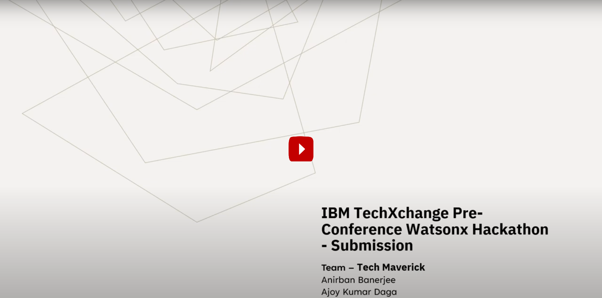](https://www.youtube.com/watch?v=sftaErGwO00)

### **📄 Dataset (Source: Hugging Face)**

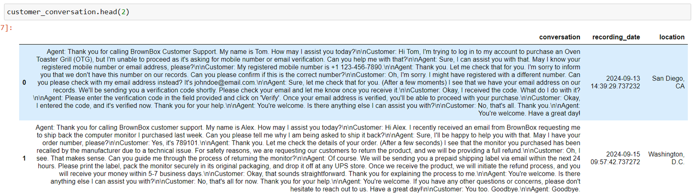

### **🧠 Sentiment Analysis** (Model: `granite-13b-instruct-v2`)

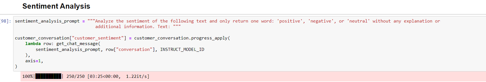

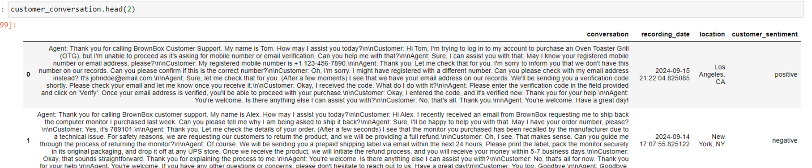

### **📝 Text Summarization** (Model: `granite-13b-chat-v2`)

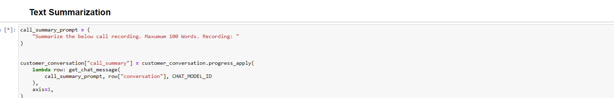

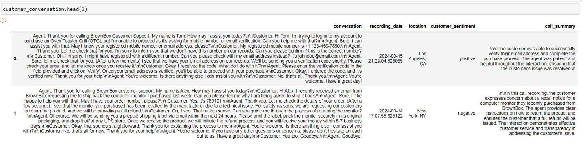

### **🔍 Feature Extraction** (Model: `granite-13b-chat-v2`)

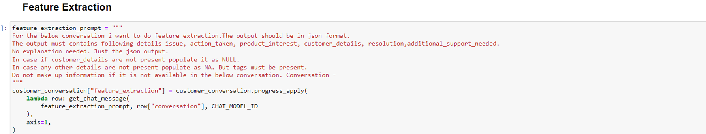

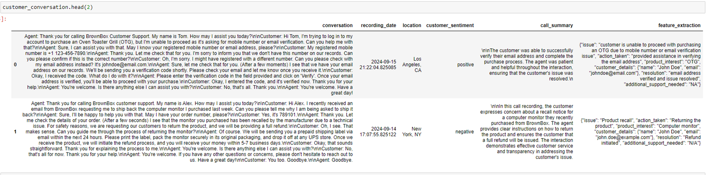

### **📅 Customer Sentiment by Day (Plotly)**

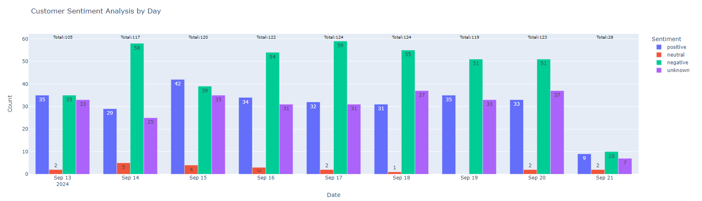

### **📊 Top 10 User Interest (Categories) (Plotly)**

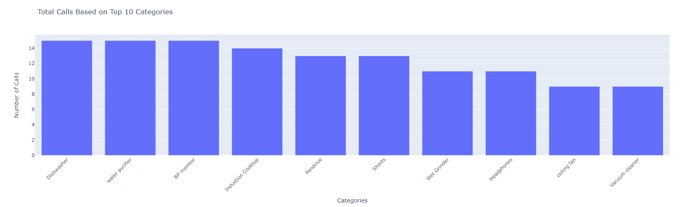

### **☁️ Word Cloud Dashboard (Plotly)**

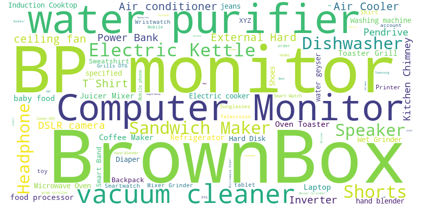

### **📍 Location-Wise Call Records (Plotly)**

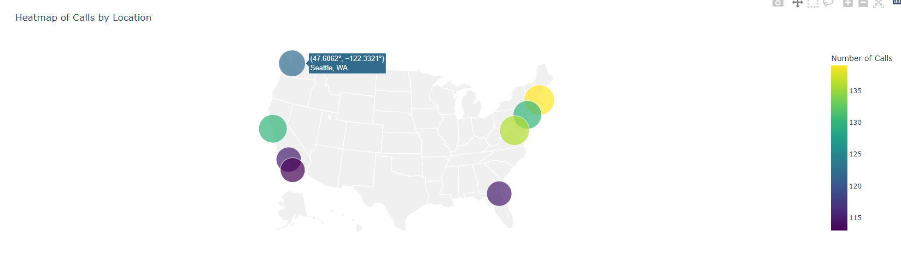

## **🎥 Presentation** 
[**Slide Deck**](https://github.com/meanirban100/IBM-Watsonx-Hackathon/blob/main/IBM-Watsonx-Presentation.pptx)

## **📝 Note** 
This submission is part of the **IBM TechXchange Pre-Conference Watsonx Hackathon**.  

Refer to the [Hackathon Page](https://compete.pretxchack.watsonx-challenge.ibm.com/competitions/pre-txc) for more details.

## **💡 Credits** 
**[Team - Tech Maverick](https://compete.pretxchack.watsonx-challenge.ibm.com/competitions/pre-txc/teams/710)**
- **Anirban Banerjee**  
- **Ajoy Kumar Daga**

