# Enhanced Customer Experience & Improved Employee Productivity using IBM-Watsonx

## Index
1. [Background](#background)
2. [Challenges](#challenges)
3. [Solution Stack](#solution-stack)
4. [Technical Details](#Technical-Details)
5. [LLM Model Used](#llm-model-used)
6. [Way Forward](#way-forward)
7. [Solution Architecture](#solution-architecture)
8. [Application Walkthorugh](#application-walkthorugh)
9. [Presentation](#Presentation)
10. [Note](#Note)
11. [Credits](##credits)

## Background
An e-commerce platform faces a challenge with its call center data. Each day, the center handles a high volume of customer interactions through customer care calls, generating extensive data files of feedback and complaints. However, this wealth of data remains underutilized, offering limited insights into overall customer satisfaction and regional issues. The platform struggles to effectively analyze this data to identify trends, sentiment, and recurring problems, which hinders its ability to improve service quality and address customer concerns proactively.

## Challenges
- **Sentiment Analysis**: Accurately determine sentiment from call conversations.
- **Call Summarization**: Summarize calls for further analysis.
- **Regional Insights**: Extract and visualize location-based trends and issues.

## Solution Stack
Integrate IBM Watsonx Granite model for sentiment analysis, call summarization, and feature extraction to address the challenges using prompt engineering techniques.

## Technical Details
- **Language**: Python 

### Dataset Used
- **Name**: NebulaByte/E-Commerce_Customer_Support_Conversations
- **Source**: [Hugging Face Dataset](https://huggingface.co/datasets/NebulaByte/E-Commerce_Customer_Support_Conversations)
- **Column Used**: conversation

### LLM Model Used
- **Sentiment Analysis**: `ibm/granite-13b-instruct-v2`
- **Call Summary, Feature Extraction**: `ibm/granite-13b-chat-v2`

### Notebook 
- [hackathon-challenge.ipynb](https://github.com/meanirban100/IBM-Watsonx-Hackathon/blob/main/hackathon-challenge.ipynb) (Generate the apikey from IBM cloud platform)

## Way Forward
- **Improved Productivity & Efficiency**: Call summary analysis can enhance both call center productivity and overall efficiency.
- **Performance-Based Compensation**: Streamlined operations could lead to improved pay structures based on performance and growth metrics.
- **Cloud Integration Flexibility**: The solution can seamlessly integrate with other cloud platforms such as AWS, Azure, and GCP, ensuring scalability and flexibility.

## Solution Architecture

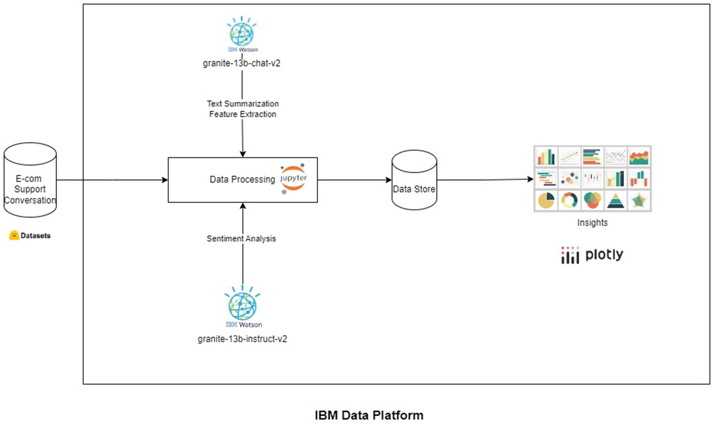

## Application Walkthorugh

### Dataset (Source - Hugging Face)

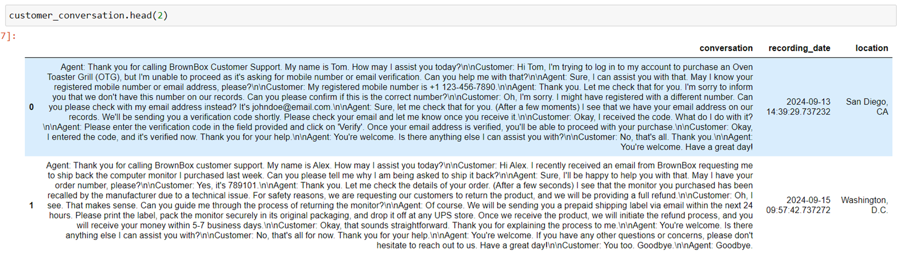

### Sentiment Analysis (Model - granite-13b-instruct-v2)

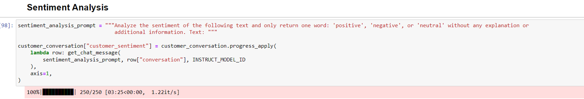

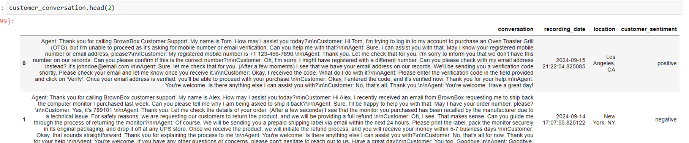

### Text Summarization (Model - granite-13b-chat-v2)

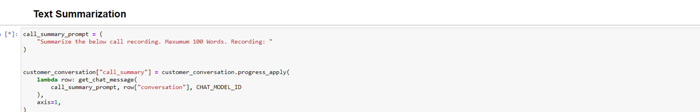

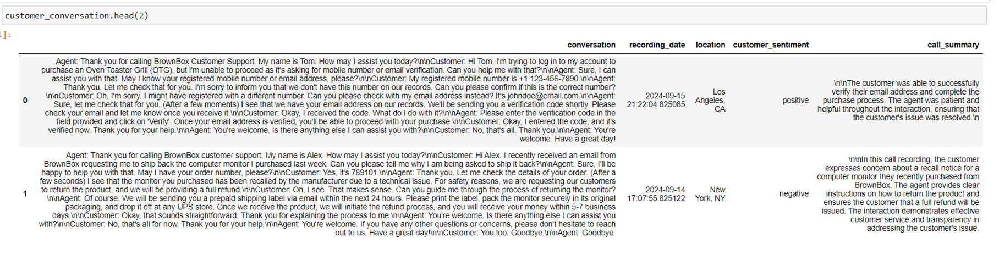

### Feature Extraction(Model - granite-13b-chat-v2)
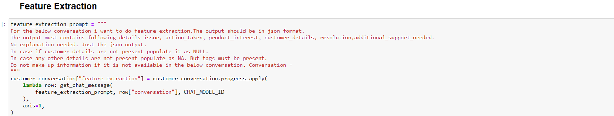

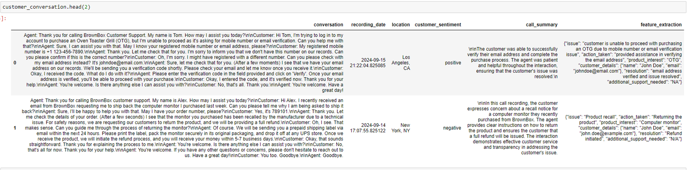

### Customer Sentiment by Day (Plotly)

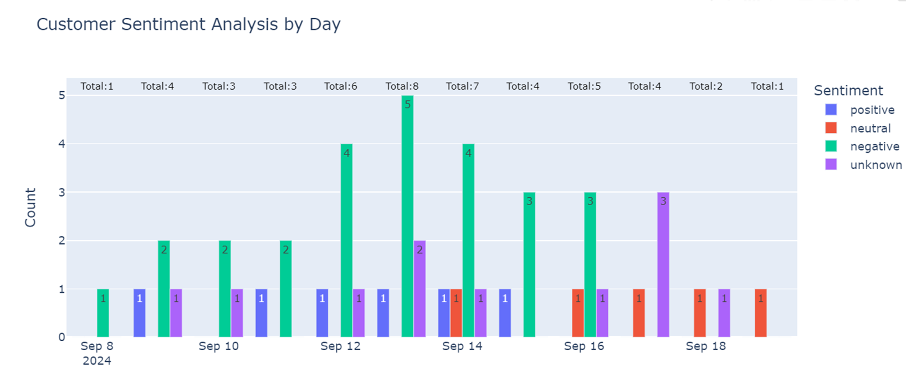

### Top 10 User Interest (Categories) - Plotly

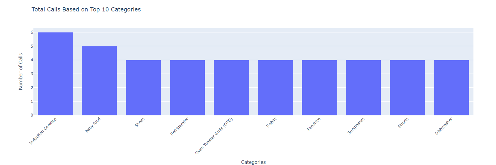

### Word Cloud Dashboard (Plotly, Wordcloud)

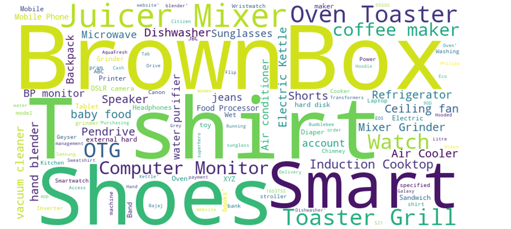

### Location Wise call records (Plotly)

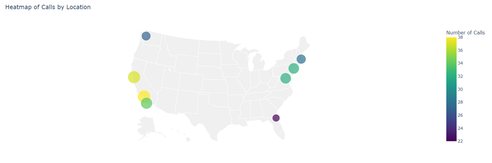

## Presentation
[Deck](https://github.com/meanirban100/IBM-Watsonx-Hackathon/blob/main/IBM-Watsonx-Presentation.pptx)

## Note

This submission is intended for the IBM TechXchange Pre-Conference Watsonx Hackathon. 

Refer [hackathon page](https://compete.pretxchack.watsonx-challenge.ibm.com/competitions/pre-txc) for further information. 

## Credits
### Anirban Banerjee
### Ajoy Kumar Daga